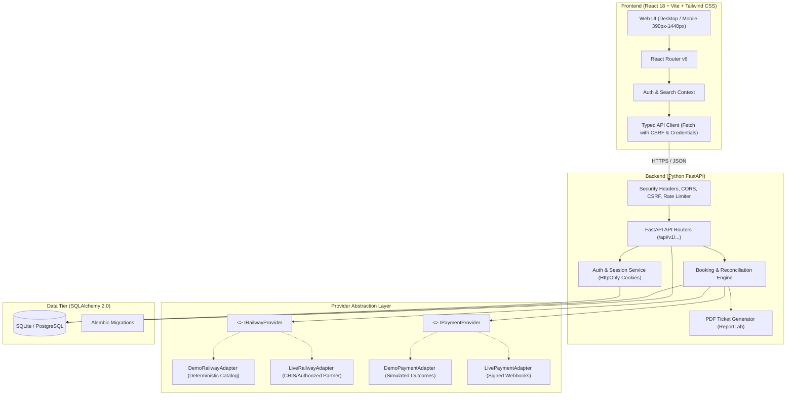
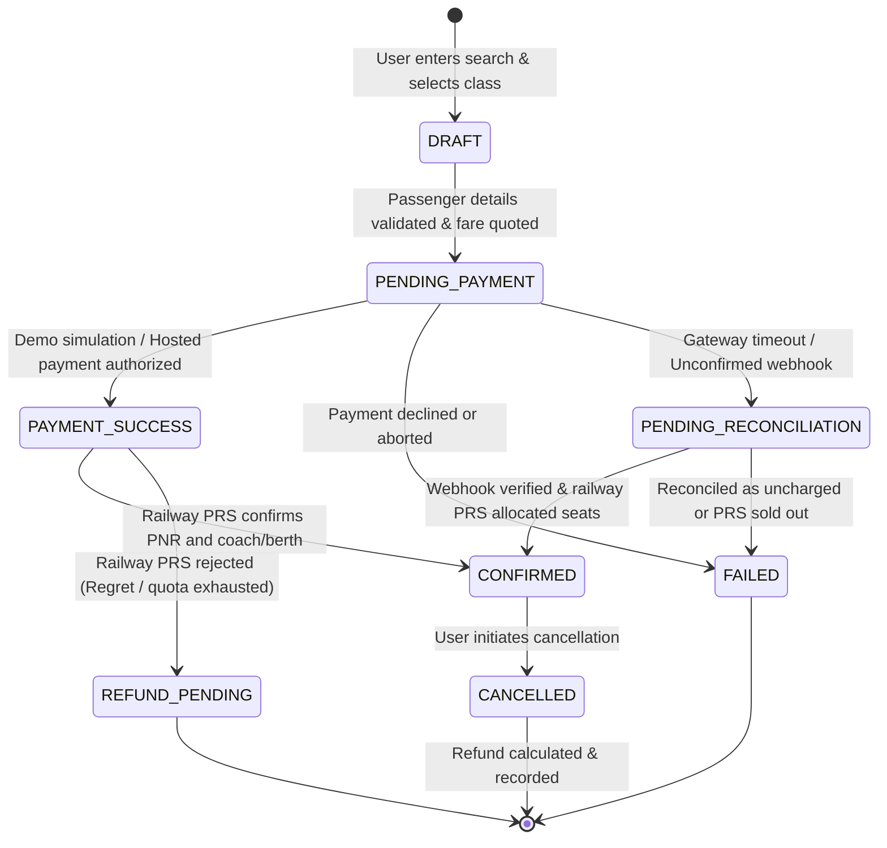

# RailVoya - System Architecture Document

**Brand:** RailVoya (`railvoya.co.in`)  
**Architecture Version:** 1.0.0  
**Stack:** React (Vite) + Tailwind CSS + Python (FastAPI) + SQLAlchemy + SQLite (Dev) / PostgreSQL (Prod)

---

## 1. High-Level Architecture Overview

RailVoya follows a clean, decoupled client-server architecture with an abstraction layer for third-party railway and payment providers. This ensures the application runs autonomously in a deterministic, fully-functional Demo Mode while being architecturally ready to connect to authorized live railway APIs (e.g., CRIS/IRCTC authorized partner gateway) and hosted payment gateways (e.g., Razorpay/Stripe).



---

## 2. Frontend Structure (`frontend/`)

Built with Vite, React 18, TypeScript, and Tailwind CSS.

```
frontend/
├── index.html                 # App shell with Inter font and SVG favicon
├── package.json               # Pinned dependencies and scripts
├── postcss.config.js          # Tailwind & Autoprefixer config
├── tailwind.config.js         # Custom tokens (primary navy, action orange, radii, fonts)
├── tsconfig.json              # Strict TypeScript configuration
├── vite.config.ts             # Dev proxy to FastAPI backend at :8000
└── src/
    ├── assets/                # Logos, SVG icons, station illustrations
    ├── config/
    │   ├── brand.ts           # Centralized brand tokens, metadata, disclaimers
    │   └── api.ts             # Base URL, endpoint constants, timeout settings
    ├── context/
    │   ├── AuthContext.tsx    # User session, login, logout, profile state
    │   └── SearchContext.tsx  # Station inputs, date, quota, class state
    ├── components/
    │   ├── common/            # Header, Footer, Button, Input, Modal, Badge, Tooltip
    │   ├── search/            # StationAutocomplete, DatePicker, QuotaSelector
    │   ├── train/             # TrainCard, AvailabilityChip, RouteTimelineModal
    │   ├── booking/           # PassengerForm, FareSummary, StepProgress, DemoNotice
    │   └── layout/            # Container, PageHeader, SidebarFilter, MobileDrawer
    ├── pages/
    │   ├── HomePage.tsx       # Hero, Search Card, Recent Searches, Features, FAQs
    │   ├── SearchResultsPage.tsx # Results list, filters, sorting, date step
    │   ├── BookingPage.tsx    # 4-step booking workflow
    │   ├── ConfirmationPage.tsx # Ticket view, PDF download, PNR display
    │   ├── MyTripsPage.tsx    # Saved bookings, cancellation flow
    │   ├── PnrStatusPage.tsx  # PNR lookup with demo examples
    │   ├── TrainStatusPage.tsx # Live running status timeline
    │   ├── LoginPage.tsx      # Sign in form with demo credentials
    │   ├── SignupPage.tsx     # Registration form
    │   ├── AccountPage.tsx    # User profile and saved passenger management
    │   ├── AboutPage.tsx      # Independent mission and architecture notes
    │   ├── ContactPage.tsx    # Message submission form with DB persistence
    │   ├── HelpPage.tsx       # FAQ accordion and travel guides
    │   ├── PrivacyPage.tsx    # Privacy policy
    │   └── TermsPage.tsx      # Terms of service
    ├── services/
    │   └── api.ts             # Type-safe fetch wrappers for all backend endpoints
    └── types/
        └── index.ts           # Train, Station, Booking, Passenger, User models
```

---

## 3. Backend Structure (`backend/`)

Built with Python FastAPI, Pydantic v2, and SQLAlchemy 2.0.

```
backend/
├── alembic/                   # Database migration environment
│   ├── env.py
│   └── versions/              # Migration scripts
├── alembic.ini                # Alembic configuration
├── pyproject.toml             # Pinned Python package dependencies via uv
├── app/
│   ├── __init__.py
│   ├── main.py                # FastAPI app initialization, middleware, routes
│   ├── core/
│   │   ├── config.py          # App settings (Pydantic BaseSettings, env vars)
│   │   ├── security.py        # Password hashing (argon2/bcrypt), session tokens
│   │   └── database.py        # SQLAlchemy engine, session maker, base model
│   ├── models/
│   │   ├── user.py            # User and Session models
│   │   ├── passenger.py       # SavedPassenger model
│   │   ├── booking.py         # Booking, BookingPassenger, and BookingEvent models
│   │   ├── payment.py         # PaymentTransaction model
│   │   └── contact.py         # ContactSubmission model
│   ├── schemas/
│   │   ├── common.py          # PaginatedResponse, ErrorResponse, HealthResponse
│   │   ├── user.py            # UserCreate, UserLogin, UserResponse
│   │   ├── train.py           # StationSearch, TrainSearchRequest, TrainDetails
│   │   ├── booking.py         # BookingCreateRequest, BookingResponse, CancelRequest
│   │   ├── pnr.py             # PnrStatusResponse
│   │   └── contact.py         # ContactCreate, ContactResponse
│   ├── providers/
│   │   ├── base.py            # IRailwayProvider and IPaymentProvider interfaces
│   │   ├── demo_railway.py    # Deterministic Indian railway catalog & simulator
│   │   ├── live_railway.py    # Live API adapter skeleton (with disabled guard)
│   │   ├── demo_payment.py    # Demo payment simulator
│   │   └── live_payment.py    # Live payment adapter with webhook verifier
│   ├── services/
│   │   ├── auth_service.py    # Session issuance, verification, cookies
│   │   ├── booking_service.py # Lifecycle management, idempotency, price revalidation
│   │   ├── pdf_service.py     # PDF ticket generator with demo watermark
│   │   └── status_service.py  # PNR and train tracking resolver
│   └── api/
│       ├── v1/
│       │   ├── auth.py        # /signup, /login, /logout, /me
│       │   ├── stations.py    # /stations/search, /stations/popular
│       │   ├── trains.py      # /trains/search, /trains/{no}/schedule
│       │   ├── availability.py# /availability/check, /fare/quote
│       │   ├── bookings.py    # /bookings (POST, GET, cancel, ticket.pdf)
│       │   ├── pnr.py         # /pnr/{pnr}
│       │   ├── running.py     # /running-status/{trainNo}
│       │   ├── contact.py     # /contact
│       │   └── system.py      # /capabilities, /health
└── tests/
    ├── conftest.py            # Test DB fixture, client fixture, mock user
    ├── test_auth.py           # Registration, login, session expiry, unauthorized
    ├── test_search.py         # Station autocomplete, train search, date validation
    ├── test_availability.py   # Quotas, seat decrement, fare calculation
    ├── test_bookings.py       # Full booking flow, idempotency, cancellation, refund
    └── test_pdf.py            # PDF generation validity and watermark presence
```

---

## 4. Database Schema & Data Models

### Entity Relationship Diagram

```mermaid
erDiagram
    USER ||--o{ SESSION : has
    USER ||--o{ SAVED_PASSENGER : saves
    USER ||--o{ BOOKING : places
    BOOKING ||--|{ BOOKING_PASSENGER : includes
    BOOKING ||--o{ BOOKING_EVENT : logs
    BOOKING ||--o{ PAYMENT_TRANSACTION : has
    CONTACT_SUBMISSION }|..|| USER : "optionally linked"

    USER {
        string id PK
        string email UK
        string password_hash
        string full_name
        string phone
        datetime created_at
        datetime updated_at
    }

    SESSION {
        string id PK
        string user_id FK
        string session_token UK
        datetime expires_at
        datetime created_at
    }

    SAVED_PASSENGER {
        string id PK
        string user_id FK
        string full_name
        int age
        string gender
        string berth_preference
        string nationality
        datetime created_at
    }

    BOOKING {
        string id PK
        string user_id FK
        string pnr_number UK
        string train_number
        string train_name
        string origin_code
        string destination_code
        date journey_date
        string travel_class
        string quota
        string status
        decimal base_fare
        decimal tatkal_charge
        decimal gst_amount
        decimal total_amount
        decimal refund_amount
        string idempotency_key UK
        datetime created_at
        datetime updated_at
    }

    BOOKING_PASSENGER {
        string id PK
        string booking_id FK
        string full_name
        int age
        string gender
        string berth_preference
        string assigned_coach
        int assigned_berth
        string assigned_berth_type
        string current_status
    }

    BOOKING_EVENT {
        string id PK
        string booking_id FK
        string event_type
        string message
        json metadata
        datetime created_at
    }

    PAYMENT_TRANSACTION {
        string id PK
        string booking_id FK
        string provider_reference UK
        decimal amount
        string currency
        string status
        datetime created_at
    }
```



---

## 5. Booking State Machine & Reconciliation



**Key Business Rules:**
1. **Separation of Payment & Railway Confirmation:** In live railway architectures, taking payment does *not* issue a ticket. The railway PRS must atomically confirm reservation. If PRS fails after payment capture, the system triggers `REFUND_PENDING`.
2. **Idempotency Guarantee:** Every booking request carries a client-generated UUID `idempotency_key`. Repeating a POST with the same key returns the existing booking rather than creating a duplicate charge.
3. **Re-validation:** Before capturing payment or completing demo booking, fare and quota availability are re-evaluated. If the price changed, an HTTP 409 Conflict is returned with the new quote.

---

## 6. Authentication & Session Security

- **Password Hashing:** Passwords hashed with `Argon2id` (or PBKDF2-HMAC-SHA256 with 600,000 rounds fallback) with cryptographic salt.
- **Session Tokens:** Cryptographically strong 32-byte hex tokens stored in the `sessions` table.
- **Cookie Security:**
  - `HttpOnly`: Inaccessible to JavaScript, preventing XSS token theft.
  - `SameSite=Lax`: Defends against Cross-Site Request Forgery.
  - `Secure`: Required in production (HTTPS).
  - Explicit session expiration (30 days default, invalidated on logout).
- **CSRF Token:** Handled via double-submit cookie or `X-CSRF-Token` header for mutation requests.
- **Ownership Verification:** Every endpoint accessing `/api/v1/bookings/{id}` or ticket downloads explicitly checks `booking.user_id == current_user.id`.

---

## 7. Provider Adapter Specifications

### Railway Provider Interface (`IRailwayProvider`)
```python
class IRailwayProvider(ABC):
    @abstractmethod
    async def search_stations(self, query: str) -> List[Station]: ...
    
    @abstractmethod
    async def search_trains(self, origin: str, destination: str, date: date, travel_class: Optional[str] = None, quota: str = "GN") -> List[TrainSearchResult]: ...
    
    @abstractmethod
    async def get_train_schedule(self, train_number: str) -> TrainSchedule: ...
    
    @abstractmethod
    async def check_availability(self, train_number: str, origin: str, destination: str, date: date, travel_class: str, quota: str) -> AvailabilityQuote: ...
    
    @abstractmethod
    async def reserve_ticket(self, booking: BookingCreateInternal) -> RailwayReservationResult: ...
    
    @abstractmethod
    async def cancel_ticket(self, pnr: str, passenger_ids: List[str]) -> CancellationResult: ...
    
    @abstractmethod
    async def get_pnr_status(self, pnr: str) -> PnrStatusResult: ...
    
    @abstractmethod
    async def get_running_status(self, train_number: str, journey_date: date) -> RunningStatusResult: ...
```

### Capability Negotiation Endpoint (`/api/v1/system/capabilities`)
Returns:
```json
{
  "mode": "demo",
  "brand_name": "RailVoya",
  "domain": "railvoya.co.in",
  "railway_provider": "DemoRailwayAdapter",
  "live_booking_enabled": false,
  "payment_provider": "DemoPaymentAdapter",
  "live_checkout_enabled": false,
  "blocked_integrations": [
    {
      "name": "CRIS/IRCTC Live PRS",
      "reason": "Requires authorized Indian Railways partner credentials and IP whitelisting."
    },
    {
      "name": "Live Payment Gateway",
      "reason": "Requires production merchant API keys and webhook secrets."
    }
  ]
}
```

---

## 8. Deployment & Containerization

- **Development:**
  - Backend: `uv run uvicorn app.main:app --reload --port 8000`
  - Frontend: `npm.cmd run dev` (Vite on port 5173 with proxy to 8000)
- **Containerization:** Multi-stage `Dockerfile` and `docker-compose.yml` orchestrating FastAPI backend, built React static distribution served via Nginx/Caddy or FastAPI static mount, and optional PostgreSQL container.
- **Project IDX / Firebase Studio:** `.idx/dev.nix` configuring Node.js 20+, Python 3.12, and automatic startup preview.
